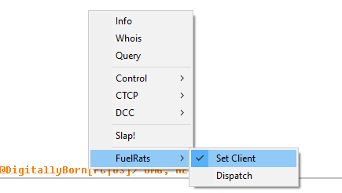
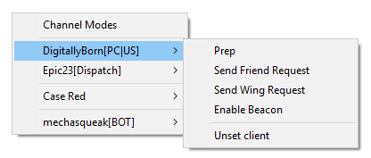
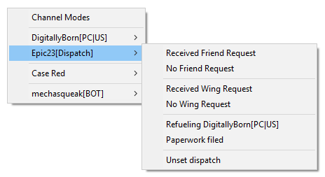
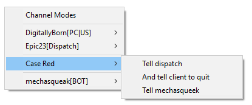
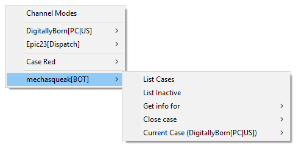

# Fuel Rats mIRC Helper

## What's it do?
- Tracks who is currently acting dispatch
- Tracks your current client
- Gives quick menus to send the most common statements to client or dispatch
- Adds quick interactions for mechasqueak (our IRC bot)

## Installation
1. Open mIRC
1. Open the scripts editor (Tools -> Scripts Editor)
1. Load the script (File -> Load ...)
1. Click `Ok` to close the editor

## Usage
### Selecting dispatch and client
First, you need to identify the player who is currently dispatch. You do this by right-clicking the user's nickname (in the channel or in the nicklist).

Next, you will need to select your current client.

### Sending instructions to the client
Once a client is selected, right-clicking in the channel will display their name as a menu. Hovering over the client name will provide you with common instructions, such as prepping the user for rescue, how to send friend and wing invites, and how to enable your beacon. You can also unset the current client.

### Fast communication with dispatch
Once dispatch is set, thier name will be shown as a menu and will provide many common interactions, such as when the client sends a friend request or wing invite.

### Case Red

### mechasqueak

## Message formats
These are the message formats sent:
- `<client>`
  - prep: `!prep <client>`
  - Send Friend Request: `!pcfr <client>`
  - Send Wing Invite: `!pcwr <client>`
  - Enable Beacon: `!beacon <client`
- `<dispatch>`
  - Received Friend Request: `<dispatch>: FR+ <client>`
  - No Friend Request: `<dispatch>: FR- <client>`
  - Received Wing Request: `<dispatch>: WR+ <client>`
  - No Wing Request: `<dispatch>: WR- <client>`
  - Refueling `<client>`: `<dispatch>: refueling <client>`
  - Paperwork filed: `<dispatch>: <client> paperwork filed`
- Case Red
  - Tell dispatch: `<dispatch>: <client> is now CR!`
  - And tell client to quit:
    1. `<dispatch>: <client> is now CR!`
    2. `!pcexit <client>`
  - Tell mechasqueek: `!inject <client> Case Red`
- mechasqueak[BOT]
  - List Cases: `!list`
  - List Inactive: `!list -i`
  - Get info for
    - 0: `!quote 0`
    - 1: `!quote 1`
  - Close case
  - 0: `!clear 0`
  - 1: `!clear 1`
